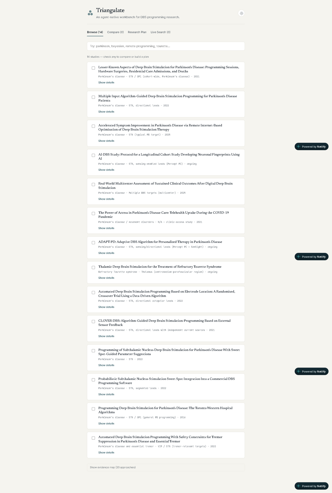
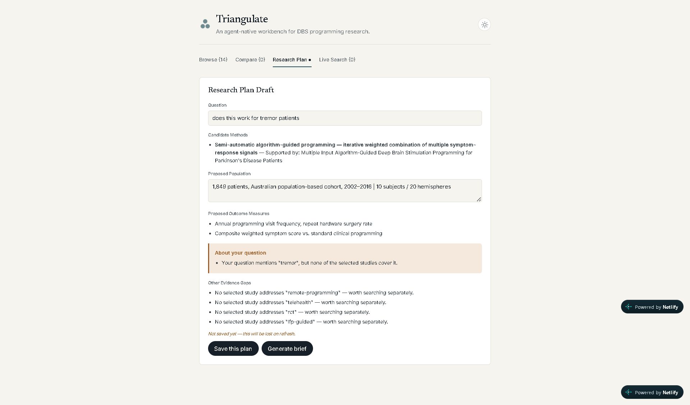
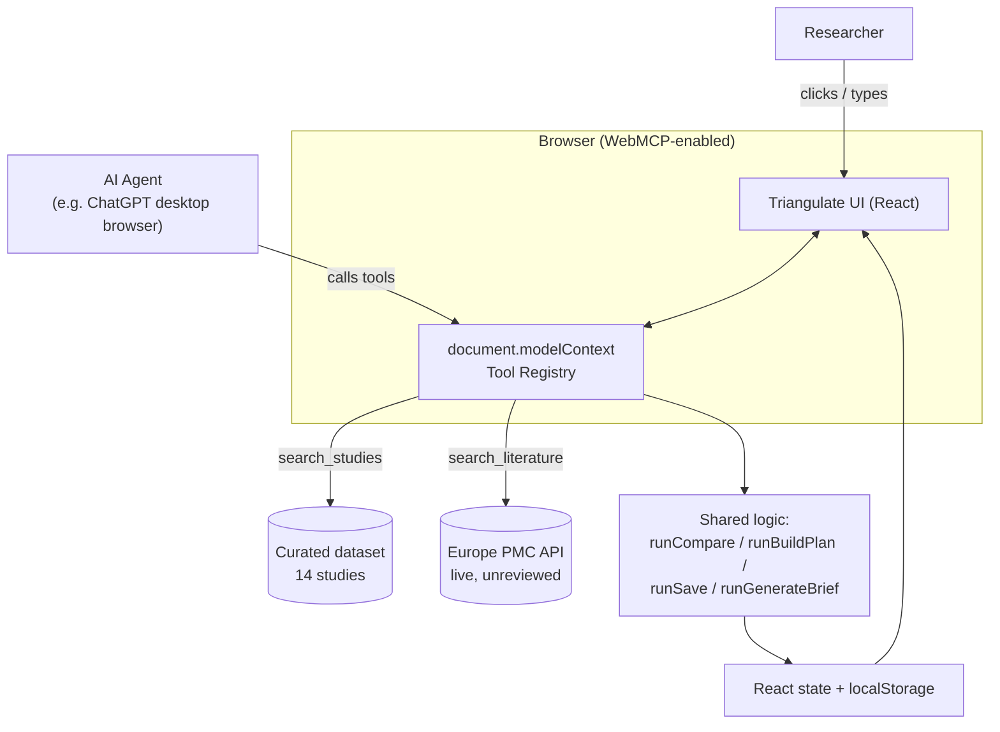
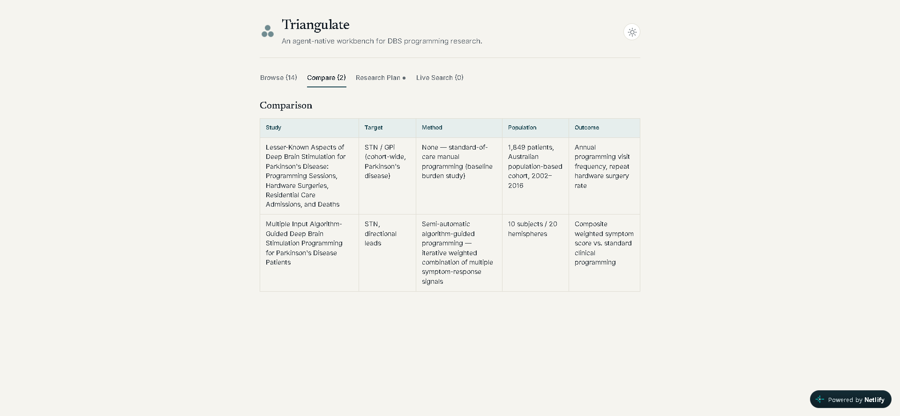

# Triangulate

> Where researchers and their AI agents triangulate real DBS research evidence together.


**[Live app](https://triangulate-dbs.netlify.app/) · [Demo video](#) · Built for [The WebMCP Challenge](https://webmcp.devpost.com)**

**Research use only.** Triangulate does not provide patient-specific clinical advice, determine DBS stimulation settings, or control implanted devices. It's a literature research and planning tool for researchers.



## What is DBS programming, and why does it need this?

Deep brain stimulation (DBS) is a treatment where a surgically implanted device sends electrical pulses to specific brain regions, used for conditions like Parkinson's disease and essential tremor. After the implant surgery, a clinician has to *program* it — choosing which electrode contacts fire, at what strength and frequency, out of a huge combination of possible settings — to control symptoms without side effects. Today that tuning is done almost entirely by trial and error in repeated clinic visits, and there's no standard method for it.

- Patients average **6.9 programming visits in year one**, dropping to **2.8/year** after — for a device implanted for a decade or more.
- Over half need a repeat hardware surgery.
- *(Source: a 1,849-patient Australian cohort — [full citation below](#curated-evidence-base).)*

The research trying to fix this is real and published — image-guided algorithms out of Charité Berlin, sweet-spot mapping from Bern's ARTORG Center, sensor-guided approaches, the foundational Toronto Western protocol that's still the baseline everyone measures against — but it's scattered across a dozen-plus papers nobody has unified into one searchable place.

## What Triangulate does

A researcher, or their AI agent using the same tools, can:

- **Search** 14 curated studies by free text, condition, target region, method, or population.
- **Compare** 2–4 studies side by side.
- **Build a research plan** from a question and a set of studies: candidate methods with rationale, proposed population, proposed outcome measures, and evidence gaps — including gaps specific to the exact wording of the question.
- **Save** a plan so it survives a reload.
- **Generate a brief** — copyable, downloadable, cited markdown.
- **Search live literature** beyond the curated set via Europe PMC, clearly labeled unreviewed, never silently merged with vetted results.



## Why WebMCP

A traditional research site assumes a human operates every control by hand. Triangulate exposes those same operations as browser-native WebMCP tools via `document.modelContext.registerTool()`, so an AI agent can search evidence, compare studies, build a plan, and generate a brief — no separate backend integration, no scraping a UI never built for it. The human and the agent act on the same application state through the same functions: `runSearch`, `runCompare`, `runBuildPlan`, `runSave`, `runGenerateBrief`. A study id returned by `search_studies` is exactly what `compare_protocols` and `build_research_plan` expect as input — the tools compose by design, not by coincidence.

## Verified — straight from the browser, not a claim

```js
document.modelContext.getTools().then(tools => console.log(tools.map(t => t.name)));
// → ["build_research_plan", "compare_protocols", "generate_research_brief",
//    "save_to_workspace", "search_literature", "search_studies"]
```

And a real `build_research_plan` call, question `"does this work for tremor patients"`, against three selected studies — the question is checked against the dataset's real tag vocabulary at call time, which is why a *different* question against the *same* studies produces a *different* gap list:

```json
{
  "questionSpecificGaps": [
    "Your question mentions \"tremor\", but none of the selected studies cover it."
  ]
}
```

## Architecture



## The six tools

| Tool | Does |
|---|---|
| `search_studies` | Structured + free-text search: condition, target region, method, population |
| `compare_protocols` | Side-by-side table for 2–4 studies |
| `build_research_plan` | Candidate methods with rationale, proposed population/outcomes, evidence gaps — question-specific ones first |
| `save_to_workspace` | Persists a plan to `localStorage` |
| `generate_research_brief` | Plan → cited, exportable markdown |
| `search_literature` | Live Europe PMC search beyond the curated set, labeled unreviewed |



## Run it locally

```bash
git clone https://github.com/dekunlab/triangulate.git
cd triangulate
npm install
npm run dev
```

In Chrome, enable `chrome://flags/#enable-webmcp-testing`, relaunch, open the dev URL.

No backend. The dataset ships with the app; Europe PMC's API takes direct browser requests.

## Curated evidence base

1. *Lesser-Known Aspects of Deep Brain Stimulation for Parkinson's Disease* (2021). Parkinsonism & Related Disorders. https://pubmed.ncbi.nlm.nih.gov/34114293/
2. *Multiple Input Algorithm-Guided Deep Brain Stimulation Programming for Parkinson's Disease Patients* (2022). npj Parkinson's Disease. https://www.nature.com/articles/s41531-022-00396-7
3. *Accelerated Symptom Improvement in Parkinson's Disease via Remote Internet-Based Optimization of Deep Brain Stimulation Therapy* (2025). Communications Medicine. https://www.nature.com/articles/s43856-025-00744-7
4. *AI-DBS Study: Protocol for a Longitudinal Cohort Study Developing Neuronal Fingerprints Using AI* (ongoing). PMC. https://www.ncbi.nlm.nih.gov/pmc/articles/PMC12086899/
5. *Real-World Multicenter Assessment of Sustained Clinical Outcomes After Digital Deep Brain Stimulation* (2025). npj Digital Medicine. https://www.nature.com/articles/s41746-025-02315-5
6. *The Power of Access in Parkinson's Disease Care: Telehealth Uptake During the COVID-19 Pandemic* (2021). PMC. https://www.ncbi.nlm.nih.gov/pmc/articles/PMC9021746/
7. *ADAPT-PD: Adaptive DBS Algorithm for Personalized Therapy in Parkinson's Disease* (ongoing). ClinicalTrials.gov, NCT04547712.
8. *Thalamic Deep Brain Stimulation for the Treatment of Refractory Tourette Syndrome* (ongoing). ClinicalTrials.gov, NCT01817517.
9. *Automated Deep Brain Stimulation Programming Based on Electrode Location: A Randomised, Crossover Trial Using a Data-Driven Algorithm* (2022). The Lancet Digital Health. https://pubmed.ncbi.nlm.nih.gov/36528541/
10. *CLOVER-DBS: Algorithm-Guided Deep Brain Stimulation-Programming Based on External Sensor Feedback* (2021). Journal of Parkinson's Disease. https://doi.org/10.3233/jpd-202480
11. *Programming of Subthalamic Nucleus Deep Brain Stimulation for Parkinson's Disease With Sweet Spot-Guided Parameter Suggestions* (2022). Frontiers in Human Neuroscience. https://www.ncbi.nlm.nih.gov/pmc/articles/PMC9663652/
12. *Probabilistic Subthalamic Nucleus Stimulation Sweet Spot Integration Into a Commercial DBS Programming Software* (2022). Neuromodulation. https://pubmed.ncbi.nlm.nih.gov/35088739/
13. *Programming Deep Brain Stimulation for Parkinson's Disease: The Toronto Western Hospital Algorithms* (2016). Brain Stimulation. https://pubmed.ncbi.nlm.nih.gov/34819915/
14. *Automated Deep Brain Stimulation Programming With Safety Constraints for Tremor Suppression in Parkinson's Disease and Essential Tremor* (2022). Journal of Neural Engineering. <https://pubmed.ncbi.nlm.nih.gov/35921806/>

## Limitations, stated plainly

- Live results are bibliographic metadata only — title, authors, journal, year, link. No auto-generated findings for papers nobody has vetted, and no cross-comparison with the curated tier — that would mean claiming structure for evidence nobody read.
- 14 curated studies, not exhaustive. A real starting point, not a coverage claim.
- No accounts. Saved plans live in browser `localStorage`, per device.

## What's next

- Promote a live result into the curated tier with one click, after a human reads it.
- Accounts, so a workspace follows a researcher across devices.
- Grow the curated base past 14 as the literature grows.

## License

MIT — see [LICENSE](./LICENSE).